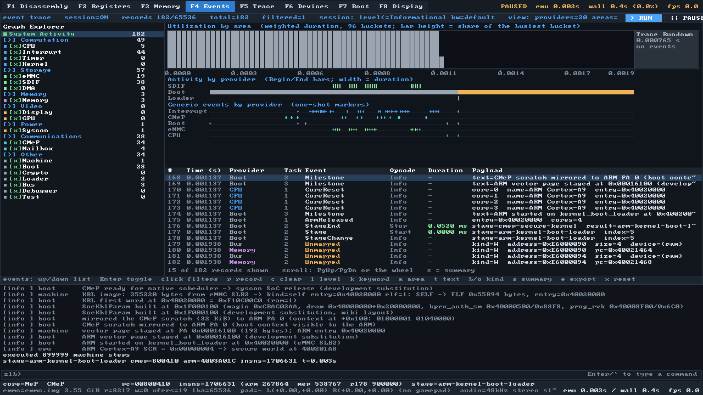
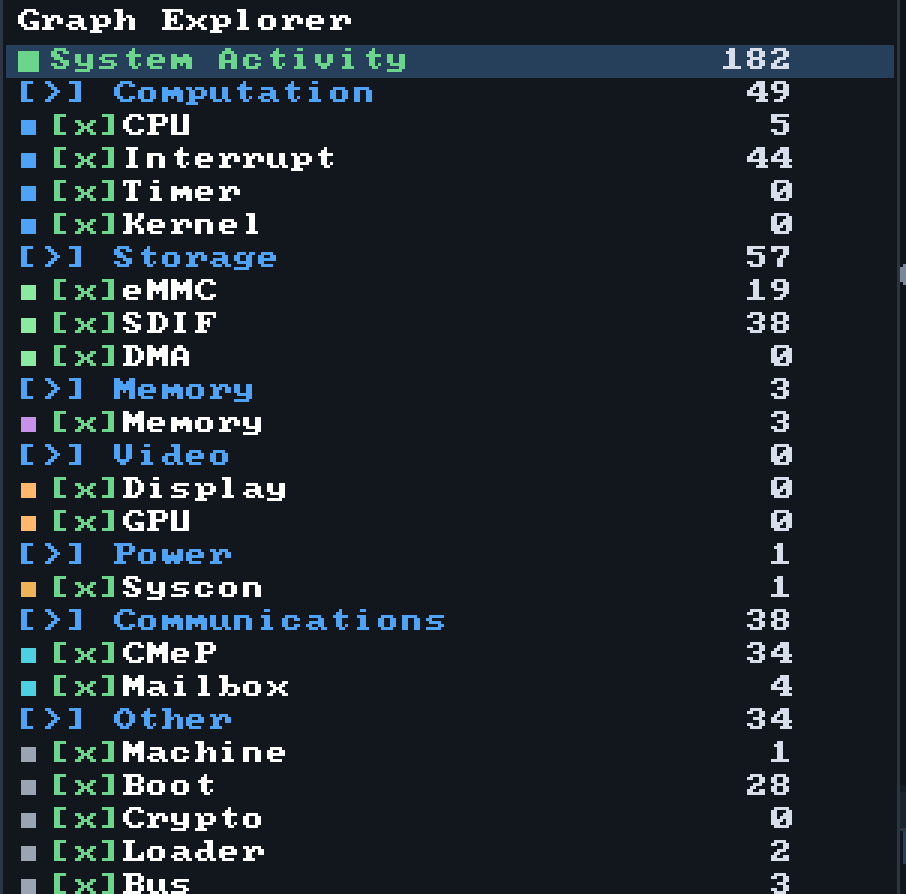
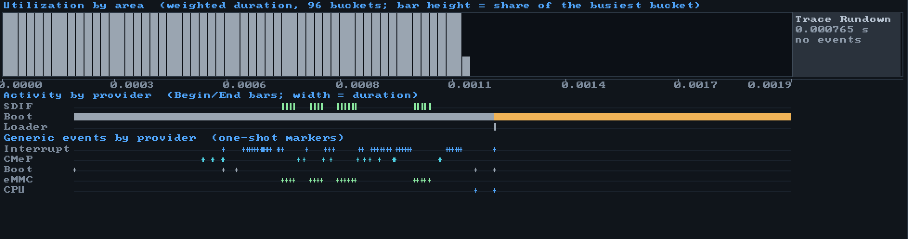
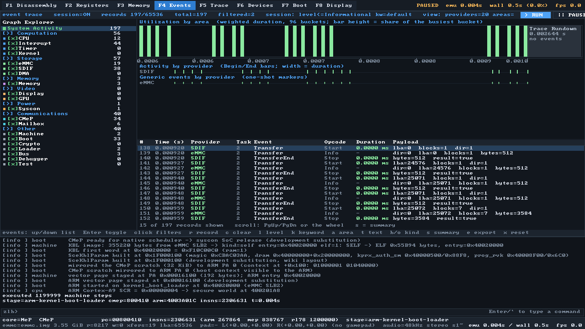

# События: трассировка в стиле ETW

`zeliboba` умеет записывать структурированные события подсистем эмулятора и
показывать их графическую сводку — по образцу Windows ETW / WPA. Это не замена
`trace` (кольцевой лог обращений к шине) и не `log` (текстовые записи): события
это третья, самая «богатая» форма наблюдаемости, где у каждой записи есть
провайдер, уровень, ключевое слово, задача, opcode и полезная нагрузка, а
длительные операции представлены парой Begin/End.

```
$ build/bin/zeliboba.exe -q -ex "event" -ex "runm 40000" -ex "event stat 8"
session ON  level<=Informational  keywords=default  providers=20/20  capacity=65536
records 219/65536  total=219  filtered=3  sequence=219  open activities=1
view    219 records, span 0.000000..0.002122 s

provider       task opcode   event                 count  weight(ms)  %weight    min(ms)    max(ms)
Boot           2    Start    Stage                     5       1.136   100.0%     0.0000     0.6435
Interrupt      1    Info     Raise                    44       0.000     0.0%     0.0000     0.0000
CMeP           2    Info     Bigmac                   34       0.000     0.0%     0.0000     0.0000
eMMC           2    Info     Transfer                 19       0.000     0.0%     0.0000     0.0000
```



## Модель

Событие — это запись фиксированного размера:

| Поле | Смысл |
|---|---|
| `time_ns` | эмулированное время (наносекунды от сброса), а не реальное |
| `sequence` | монотонный номер, переживает перезапись кольца |
| `provider` | провайдер (`Boot`, `CPU`, `eMMC`, …) — у каждого своё имя и GUID |
| `level` | ETW-уровень: Critical, Error, Warning, Informational, Verbose |
| `keyword` | 64-битная маска подсистемы (`boot`, `storage`, `interrupt`, …) |
| `task` / `opcode` | ETW-задача и opcode (`Info` для одиночных, `Start`/`Stop` для активностей) |
| `activity` / `parent_activity` | 64-битный id операции и объемлющей операции |
| `fields[4]` | до четырёх именованных полей: `u64`/`i64`/`bool`/`double`/адрес/строка |

Определения событий живут в **манифесте** (`src/event/providers.h`): для каждого
`provider` + `id` указаны уровень, opcode, задача, ключевое слово, имя и состав
полей. Инструментируемый код называет только провайдера и id, поэтому уровень и
ключевое слово нельзя «забыть» или перепутать:

```cpp
events().event(EventProvider::Boot, ev::boot::kMilestone)
    .field("text", text)
    .field("stage", std::string(to_string(boot_.stage)))
    .emit();
```

### Одиночные события и Begin/End

* **Одиночное** (`opcode = Info`) — «что-то произошло»: сброс, IRQ, кадр, команда.
* **Активность** — пара `Start`/`Stop` с общим `activity`:

```cpp
EventLog::Builder begin = events().begin_event(EventProvider::Sdif, ev::sdif::kTransferBegin);
begin.field("lba", lba).field("blocks", blocks).field("dir", read ? 1 : 0);
const u64 activity = begin.emit().activity;      // запоминаем id
...
events().end_event(activity, EventProvider::Sdif, ev::sdif::kTransferEnd)
     .field("bytes", bytes).field("result", ok).emit();
```

Есть и RAII-форма `EventActivity`, которая закрывает операцию в деструкторе
(в том числе при досрочном `return`). Вложенные активности получают
`parent_activity`, поэтому в панели видно, что, например, расшифровка SELF
проходила внутри этапа загрузки.

### Время

Метка времени — эмулированное время, а не время хоста: `Vita::emulated_nanoseconds()`
считается из счётчика циклов Kermit (333 МГц). Шаг — один слот планировщика
(`budget().arm` = 256 циклов ≈ 769 нс), поэтому два события внутри одного слота
имеют одинаковую метку. Для сравнения длительностей этого достаточно, для
инструкционной точности — нет.

## Хранение

* Одно кольцо на машину (`EventLog`), по умолчанию 65 536 записей; старые
  перезаписываются.
* Счётчики по провайдерам (сколько всего, сколько Begin/End, суммарная и
  максимальная длительность, открытые операции) **не зависят от перезаписи** —
  сводка остаётся верной и после миллиона событий.
* Сессия однопоточная: эмуляция, отладчик и SDL3-фронтенд работают в одном
  потоке, блокировок нет.
* `Vita::build()` делает свой лог активным процесс-глобально (`zlb::events()`),
  поэтому шина, устройства и ядра эмитят события без указателя на машину.
  `Vita::reset()` очищает лог: трасса всегда начинается со сброса.

## Провайдеры и области

Graph Explorer панели группирует провайдеров по областям (как WPA).

| Область | Провайдеры |
|---|---|
| Computation | CPU, Interrupt, Timer, Kernel |
| Storage | eMMC, SDIF, DMA |
| Memory | Memory |
| Video | Display, GPU |
| Power | Syscon |
| Communications | CMeP, Mailbox |
| Other | Machine, Boot, Crypto, Loader, Bus, Debugger, Test |

`event providers` печатает манифест: область, состояние подписки, счётчики,
GUID и число объявленных событий.

## Что инструментировано

| Подсистема | События |
|---|---|
| Машина | `MachineBuild`, `MachineReset`, `PartsFitted`, `SaveState`/`LoadState` |
| Цепочка загрузки | этапы как активности `Stage`/`StageEnd` (5 этапов за прогон), `StageChange`, `Milestone` (зеркало `add_milestone`), `Handshake` (0x101/0x009), `ArmReleased`, `Complete`, `Failure` |
| Ядра | `CoreReset` (4×ARM + CMeP + RL78), `Exception` (abort/SMC/HVC; SVC пропускается, чтобы не залить трассу системными вызовами), `Undefined`, `Deliver` (IRQ/FIQ) |
| GIC | `Raise` (по фронту), `Deliver`, `Eoi`, `Enable` |
| Таймеры | `Expire`, `Arm` (GlobalTimer, PrivateTimer, VitaSystemTimer, интервал-таймер Ernie) |
| Шина | `Unmapped` (Warning, включено по умолчанию), `MmioRead`/`MmioWrite`/`RamAccess` (Verbose, ключевое слово `bus-access`, по умолчанию выключено) |
| eMMC / SDIF / DMA | `Transfer` + `TransferEnd` (активности), `Command`, `Error` |
| Дисплей | `ModeSet`, `FrameBuffer`, `FramePresent`, `Turnover`/`TurnoverEnd`, `Vblank`, `DsiCommand` |
| Syscon | `ScCommand`/`ScReply`, `PowerState` (release_soc), `Reset` (кнопка питания) |
| CMeP | `ServiceCall`, `Bigmac` (crypto-движок), `Bignum`, `Keyring` |
| Mailbox | `Handshake`, `Send`, `Receive`, `Irq` |
| Загрузчик | `Load`/`LoadEnd` — активность на каждый образ (имя, размер, entry, результат) |
| Отладчик | `Breakpoint`, `Watchpoint`, `Command` (Verbose) |

## Команды отладчика

Сессия — то, что машина **записывает**; фильтр вида — то, что показывают
`dump`/`stat`/`activities`/`timeline` и панель Events. Это разные вещи, и
команды их не смешивают.

| Команда | Что делает |
|---|---|
| `event` | состояние сессии и фильтра вида |
| `event on` / `event off` | включить/выключить запись |
| `event clear` / `event reset` | очистить записи и счётчики / плюс sequence и стек активностей |
| `event level <lvl>` | уровень сессии: `critical..verbose` |
| `event keyword <mask>` | ключевые слова сессии: имена через `\|`, hex, `all`, `default`, `none` |
| `event enable\|disable <провайдер\|область\|all>` | подписка сессии |
| `event providers` | манифест провайдеров со счётчиками |
| `event dump [n]` | последние `n` подходящих записей (по умолчанию 32) |
| `event stat [n]` | сводка Count / Weight / %Weight / min / max |
| `event activities [n]` | пары Begin/End с длительностями и id |
| `event timeline [buckets]` | текстовая гистограмма по областям |
| `event filter …` | фильтр вида: `level`, `keyword`, `provider`, `area`, `text`, `time <lo> <hi>`, `kind activity\|oneshot`, `clear` |
| `event find <слова>` | выставить текстовый фильтр и показать совпадения |
| `event save <file.csv>` | экспорт отфильтрованных записей в CSV |

Фильтр вида живёт в `Debugger` (`Debugger::event_filter()`) и **общий с панелью
Events**: набранное в консоли сразу меняет графики, а клики по дереву — то, что
покажет `event dump`.

## Экспорт

CSV: `sequence,time_ns,time_s,provider,provider_guid,area,task,event_id,event,opcode,level,activity,parent,payload`.
Запятые внутри payload заменяются на `;`, чтобы файл оставался плоским.

## Панель Events (SDL3, F4)



* **Graph Explorer** (слева) — область → провайдер, с галочкой подписки сессии и
  подсветкой состояния фильтра вида. Клик по строке переключает фильтр вида,
  клик по чекбоксу — подписку сессии, `Enter` — фильтр вида, `Shift+Enter` — сессию.
* **Utilization by area** — стек по областям: высота столбца пропорциональна
  взвешенной длительности (а если активностей нет — числу событий).
* **Trace Rundown** — справа: эмулированное время после последнего события.
  Ширина полосы фиксированная (ось «с изломом»), реальная длительность написана
  на самой полосе — так события не сжимаются в узкую полоску.
* **Activity by provider** — полосы Begin/End; открытая активность жёлтая.
* **Generic events by provider** — маркеры одиночных событий.
* **Таблица** — `#`, время, провайдер, задача, событие, opcode, длительность,
  payload; `s` переключает на сводную таблицу Count/Weight/%Weight.



Горячие клавиши вкладки: `↑/↓` (или PgUp/PgDn, колесо) — по списку, `Tab` между
деревом и таблицей (клик тоже), `Enter` — переключить узел, `r` — запись,
`c` — очистить, `l` — уровень сессии, `k` — ключевые слова, `a` — область вида,
`t` — текстовый фильтр по выбранному узлу, `b`/`o` — только активности /
только одиночные, `s` — сводка, `e` — экспорт в `build/events.csv`, `x` — сброс
фильтра. Произвольный фильтр — через консоль (`event filter …`).

Фильтрация по области Storage:



### Run / Pause

В шапке панели на **каждой** вкладке есть кнопки `> RUN` и `|| PAUSE`. Они
запускают и приостанавливают **все ядра** — это тот же путь, что `runm`: цикл
кадра вызывает `Vita::run_slice()`, где каждый срез получает свой бюджет
инструкций. Активная сторона подсвечена; горячие клавиши `Space` (пауза) и `g`
(пуск) работают как раньше.


## Тесты

`tests/test_events.cpp`: манифест и парсинг, одиночные события и поля, фильтры
сессии (уровень, ключевые слова, провайдеры), перезапись кольца и счётчики,
активности (парность, вложенность, открытые, RAII), фильтры вида (время, текст,
вид, задача), сводка с весами, гистограмма, CSV, `tail_matching`, команды `event`,
и дымовой тест инструментирования (сборка/сброс машины даёт события Machine, CPU
и открытую активность этапа загрузки).

## Ограничения

* Разрешение времени — слот планировщика (≈769 нс), не инструкция.
* Кольцо одно и конечно: при перезаписи старые записи теряются (счётчики — нет).
* События не входят в save state: это диагностика, а не состояние машины.
* «Trace Rundown» — это не буферизация ETW, а время после последнего события;
  панель честно подписывает его длительность.
* Шинные `MmioRead`/`MmioWrite` включаются только ключевым словом `bus-access`:
  на полном прогоне это миллионы записей.
